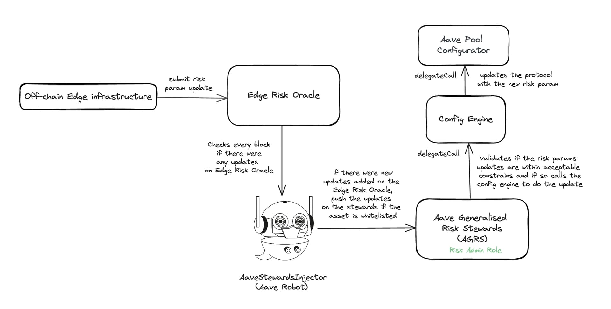

# Aave Generalized Risk Stewards (AGRS)

Expanding from the scope of CapsPlusRiskSteward, we now introduce the new RiskSteward, allowing hardly constrained risk parameter updates by risk service providers and reducing governance overhead.

[](https://bgd-labs.github.io/aave-risk-stewards-2/)

<br>

## Specification

The new RiskSteward we propose follows the same design as the CapsPlusRiskSteward: a smart contract to which the Aave Governance gives `POOL_ADMIN` the role over all v3 instances. It is controlled by a 2-of-2 multi-sig and is heavily constrained on what can do and how by its own logic.

_Note: The Risk Stewards will only be available for Aave V3.1 instances and not Aave V2 (or previous Aave v3) due to missing admin roles on Aave V2 instances and other incompatibilities._


<br/>

The following risk params could be changed by the RiskStewards:

- Supply Caps
- Borrow Caps

- LTV
- Liquidation Threshold
- Liquidation Bonus
- Debt Ceiling

- Base variable borrow rate
- Slope 1
- Slope 2
- Optimal point

- Cap parameters for [PriceCapAdapters (CAPO)](https://github.com/bgd-labs/aave-capo/)
- Discount Rate for Pendle PT CAPO

- EMode Collateral params (LTV, Liquidation Threshold, Liquidation Bonus)

#### Min Delay:

For each risk param, `minDelay` can be configured, which is the minimum amount of delay (denominated in seconds) required before pushing another update for the risk param. Please note that this is specific for a risk param and includes both in upwards and downwards direction. Ex. after increasing LTV by 5%, we must wait by `minDelay` before either increasing it again or decreasing it.

#### Max Percent Change:

For each risk param, `maxPercentChange` is the maximum percent change allowed (both upwards and downwards) for the risk param using the RiskStewards.

- Supply cap, Borrow cap, and Debt ceiling: The `maxPercentChange` is relative and is denominated in BPS. (Ex. `50_00` for +-50% relative change).
  For example, with an asset's current supply cap at 1_000_000 and `maxPercentChange` configured for supply cap at `50_00`, the max supply cap that can be configured is 1_500_000, and the minimum is 500_000 via the steward.

- LTV, LT, LB (for both normal and EMode): The `maxPercentChange` is in absolute values and is also denominated in BPS. (Ex. `5_00` for +-5% change in LTV).
  For example, for a current LTV of an asset configured at 70_00 (70%) and `maxPercentChange` configured for ltv at `10_00`, the max ltv that can be configured is 77_00 (77%) and the minimum 63_00 (63%) via the steward.

- Interest rates params: For Base Variable Borrow Rate, Slope 1, Slope 2, uOptimal the `maxPercentChange` is in absolute values and is denominated in BPS.
  For example, for a current uOptimal of an asset configured at 50_00 (50%) and `maxPercentChange` configured for uOptimal at `10_00`, the max ltv that can be configured is 55_00 (55%) and the minimum 45_00 (45%) via the steward.

- LST Cap adapter params: `snapshotRatio` must be less or equal to the actual one. The `maxPercentChange` is applied to `maxYearlyGrowthPercent`, it is relative and is denominated in BPS. (Ex. `10_00` for +-10% relative change).
  For example, for a max yearly growth percent at 10_00 and `maxPercentChange` configured at `10_00`, the max yearly growth percent that can be configured is 11_00 and the minimum 9_00 via the steward.

- Stable price cap: the `maxPercentChange` is in relative values.
  For example, for a current price cap of an oracle configured at 1_10_000000 and `maxPercentChange` configured at `1_00`, the max price cap that can be configured is 1_11_100000 and the minimum 1_08_900000 via the steward.

- Pendle discount rate CAPO: the `maxPercentChange` is in absolute values.
  For example, for a current discount rate of an oracle configured at `0.05e18` (5%) and `maxPercentChange` configured at `0.025e18` (2.5%), the max price cap that can be configured is `0.075e18` (7.5%)  and the minimum `0.025e18` (2.5%) via the steward.

After the activation proposal, these params could only be changed by the governance by calling the `setRiskConfig()` method.

_Note: The Risk Stewards will not allow setting the values to 0 for supply cap, borrow cap, debt ceiling, LTV, Liquidation Threshold, Liquidation Bonus no matter if the maxPercentChange has been configured to 100%. The Risk Stewards will however allow setting the value to 0 for interest rate param updates._

#### Restricted Assets, Oracles and EMode:

Some assets/oracles can also be restricted on the RiskStewards by calling the `setAddressRestricted()` method. This prevents the RiskStewards to make any updates on the specific asset. One example of the restricted asset could be GHO. Similarly if we don't want RiskSteward to update EMode collateral params (LTV, LT, LB) for a specific EMode category, we can mark that EModeId as restricted via `setEModeCategoryRestricted()` method.

<br>

## AGRS + Edge Infrastructure (Risk Oracles)

With the introduction of Edge Risk Oracles by Chaos Labs, which leverages advanced off-chain infrastructure to deliver real-time risk updates to the Aave protocol via the Risk Oracle, the risk updates for the Aave protocol can be automated in a constrained manner. This can be done by combining the Edge Risk Oracle with the Aave Risk Steward, using a middleware contract `AaveStewardsInjector`.

The Aave Risk Steward contract used for automated updates (called now [EdgeRiskStewardRates](./src/contracts/EdgeRiskStewardRates.sol)) for rateUpdates, has been slightly modified to only allow Interest Rates Updates on the protocol initially as a matter of extra security considerations.

The following is a simple diagram of how the system works as a whole:



### AaveStewardsInjector

The [AaveStewardsInjector](./src/contracts//AaveStewardInjectorBase.sol) is a Chainlink automation compatible contract which checks if the latest update from the Edge Risk Oracle could be pushed to the Risk Steward, and if so, injects it to the Aave Risk Stewards. The `AaveStewardsInjector` should be set as the `riskCouncil` on the Aave Risk Steward contract so it can inject updates.

The `AaveStewardsInjector` has the following major functions:

- `checkUpkeep()`: This method is called off-chain by Chainlink nodes every block to check if the latest update could be injected, and if so, calls `performUpKeep()`. It fetches the latest risk update for asset using the `getLatestUpdateByParameterAndMarket()` method on the Risk Oracle, and checks if the update can be injected into the Risk Steward if not already executed before. If the latest update is not executed or disabled, the method returns true.

- `performUpkeep()`: The `performUpkeep()` method is called by the Chainlink automation nodes when the `checkUpkeep()` method returns true. The `performUpkeep()` call injects the latest update on the Risk Steward, unless that update has been disabled by the steward injector guardian or previously executed. After an update has been injected on the Risk Steward using the params from the Risk Oracle, we mark the updateId as executed on storage mapping `_isUpdateIdExecuted[id]`. The `performUpkeep()` method is permissionless on purpose, so as to allow injections from the Risk Oracle to the Risk Steward even in case of some downtime on the automation infra via a manual trigger.

The Stewards Injector Guardian is an entity, which is the owner of the `AaveStewardsInjector` contract and has access to disable updates for the specific `updateId` using the `disableUpdateById()` method in case of any emergencies or pause the injector via `pauseInjector()`.

The `AaveStewardsInjector` contract also introduces an `EXPIRATION_PERIOD` to disallow outdated risk param updates to be injected. The `EXPIRATION_PERIOD` is set to 6 hours, which means after an update is pushed on the Edge Risk Oracle, the `AaveStewardsInjector` has a maximum of 6 hours to inject the update onto the Risk Steward otherwise the update expires.

## Security

- Certora security review: [2024-07-10](./audits/10-07-2024_Certora_AaveV3-Risk-Steward.pdf), [2025-04-20](audits/20-04-2025-Certora_AaveV3-Risk-Steward.pdf)

<br>

## Setup

```sh
cp .env.example .env
npm install
forge install
```

<br>

## Test

```sh
forge test
```

<br>

## Instructions and FAQ's

### How to I use the generator tooling to bootstrap the update?

Run `npm run generate` on your terminal in order to start the generator. The generator is a CLI tool which will generate the required helper contract which can be then run to submit updates to the risk steward. The generator will generate the helper contract in the `src/contracts/updates` directory.

To get a full list of available commands run `npm run generate --help`

```sh
npm run generate --help
$ tsx generator/cli --help
Usage: proposal-generator [options]

CLI to generate aave proposals

Options:
  -V, --version              output the version number
  -f, --force                force creation (might overwrite existing files)
  -p, --pools <pools...>      (choices: "AaveV3Ethereum", "AaveV3EthereumLido", "AaveV3EthereumEtherFi", "AaveV3Polygon",
                             "AaveV3Avalanche", "AaveV3Optimism", "AaveV3Arbitrum", "AaveV3Metis", "AaveV3Base", "AaveV3Gnosis",
                             "AaveV3Scroll", "AaveV3BNB")
  -t, --title <string>       aip title
  -a, --author <string>      author
  -d, --discussion <string>  forum link
  -c, --configFile <string>  path to config file
  -h, --help                 display help for command
```

Running `npm run generate` you should be able to do the risk updates:

```bash
npm run generate

$ tsx generator/cli
? Chains this proposal targets AaveV3Ethereum
? Short title of your steward update that will be used as contract name (please refrain from including author or date) TestRateUpdate
? Author of your proposal BGD Labs
? Link to forum discussion (Link to forum)

? What do you want to do on AaveV3Ethereum? (Press <space> to select, <a> to toggle all, <i> to invert selection, and <enter> to proceed)
❯◉ RateStrategiesUpdates
 ◯ CapsUpdates (supplyCap, borrowCap)
 ◯ CollateralsUpdates (ltv,lt,lb,debtCeiling,liqProtocolFee,eModeCategory)
 ◯ LstPriceCapUpdates (snapshotTimestamp,snapshotRatio,maxYearlyRatioGrowthPercent)
 ◯ StablePriceCapUpdates (priceCap)

? Select the assets you want to amend WETH
  Fetching info for WETH
? optimalUtilizationRate 90 %
? baseVariableBorrowRate 0 %
? variableRateSlope1 2.5 %
? variableRateSlope2 78 %
✨  Done in 38.32s.
```

The generator generates the scripts for doing the updates in `src/contracts/updates` directory.

The script can be executed by running: `make run-script network=mainnet contract_path=src/contracts/examples/EthereumExample.sol:EthereumExample broadcast=false generate_diff=true skip_timelock=false` where:

- `broadcast=` determines if the calldata should be sent to safe
- `generate_diff=` determines if diff report should be generated
- `skip_timelock=` determines if timelock errors should revert the script, helpful in generating diff report / calldata when the current timelock has not ended.

The script also emits the calldata for doing the update in the console which can be used on the safe manually as well.

### Before I will submit anything to sign, how do I test out the update, or get visibility from what will happen?

Running the script generated on the contracts in `src/contracts/updates` directory with `generate_diff=true`, there will files written into the diffs directory, which will show the params changed for the asset by the update, with before and after values which can be validated with what update is expected.

### Once I have full assurance it looks correct, how do I submit to Safe?

Once the script on the comments of the generated contract has been run with `broadcast=false`, there will be calldata emitted on the console with the contract to call. Please copy the calldata and the contract to execute it on (i.e RiskSteward) from the console and input it on the [gnosis safe UI](https://app.safe.global/) transaction builder.

If you wish to not use the UI and send the update directly please put `broadcast=true` when running the script to directly broadcast the tx using the gnosis safe.

## License

Copyright © 2024, Aave DAO, represented by its governance smart contracts.

The [BUSL1.1](./LICENSE) license of this repository allows for any usage of the software, if respecting the Additional Use Grant limitations, forbidding any use case damaging anyhow the Aave DAO's interests.
Interfaces and other components required for integrations are explicitly MIT licensed.
