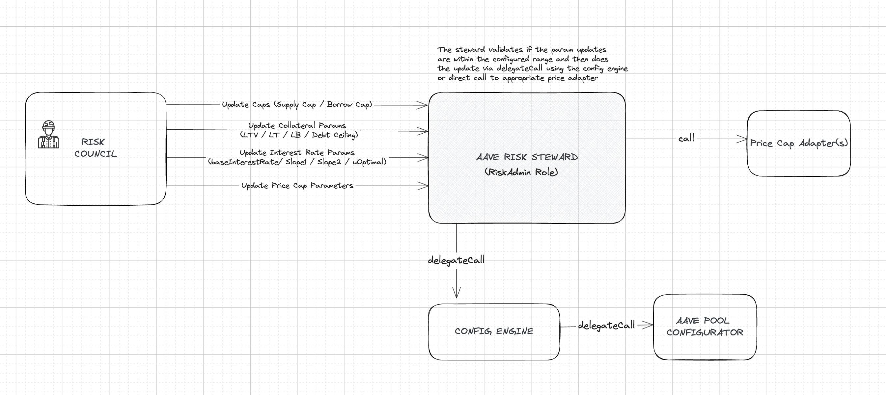

# Aave v3.1 Risk Stewards

Expanding from the scope of CapsPlusRiskSteward, we now introduce the new RiskSteward, allowing hardly constrained risk parameter updates by risk service providers and reducing governance overhead.

[](https://bgd-labs.github.io/aave-risk-stewards-2/)

<br>

## Specification

The new RiskSteward we propose follows the same design as the CapsPlusRiskSteward: a smart contract to which the Aave Governance gives `POOL_ADMIN` the role over all v3 instances, controlled by a 2-of-2 multi-sig of the risk providers, and heavily constrained on what can do and how by its own logic.

_Note: The Risk Stewards will only be available for Aave V3.1 instances and not Aave V2 (or previous Aave v3) due to missing admin roles on Aave V2 instances and other incompatibilities._



<br/>

The following risk params could be changed by the RiskStewards:

- Supply Caps
- Borrow Caps

- LTV
- Liquidation Threshold
- Liquidation Bonus
- Debt Ceiling

- Base variable borrow rate
- Slope 1
- Slope 2
- Optimal point

- Cap parameters for [PriceCapAdapters (CAPO)](https://github.com/bgd-labs/aave-capo/)

#### Min Delay:

For each risk param, `minDelay` can be configured, which is the minimum amount of delay (denominated in seconds) required before pushing another update for the risk param. Please note that this is specific for a risk param and includes both in upwards and downwards direction. Ex. after increasing LTV by 5%, we must wait by `minDelay` before either increasing it again or decreasing it.

#### Max Percent Change:

For each risk param, `maxPercentChange` which is the maximum percent change allowed (both upwards and downwards) for the risk param using the RiskStewards.

- Supply cap, Borrow cap and Debt ceiling: The `maxPercentChange` is relative and is denominated in BPS. (Ex. `50_00` for +-50% relative change).
  For example, for a current supply cap of an asset at 1_000_000 and `maxPercentChange` configured for supply cap at `50_00`, the max supply cap that can be configured is 1_500_000 and the minimum 500_000 via the steward.

- LTV, LT, LB: The `maxPercentChange` is in absolute values and is also denominated in BPS. (Ex. `5_00` for +-5% change in LTV).
  For example, for a current LTV of an asset configured at 70_00 (70%) and `maxPercentChange` configured for ltv at `10_00`, the max ltv that can be configured is 77_00 (77%) and the minimum 63_00 (63%) via the steward.

- Interest rates params: For Base Variable Borrow Rate, Slope 1, Slope 2, uOptimal the `maxPercentChange` is in absolute values and is denominated in BPS.
  For example, for a current uOptimal of an asset configured at 50_00 (50%) and `maxPercentChange` configured for uOptimal at `10_00`, the max ltv that can be configured is 55_00 (55%) and the minimum 45_00 (45%) via the steward.

- LST Cap adapter params: `snapshotRatio` must be less or equal to the actual one. The `maxPercentChange` is applied to `maxYearlyGrowthPercent`, it is relative and is denominated in BPS. (Ex. `10_00` for +-10% relative change).
  For example, for a max yearly growth percent at 10_00 and `maxPercentChange` configured at `10_00`, the max yearly growth percent that can be configured is 11_00 and the minimum 9_00 via the steward.

- Stable price cap: the `maxPercentChange` is in relative values.
  For example, for a current price cap of an oracle configured at 1_10_000000 and `maxPercentChange` configured at `1_00`, the max price cap that can be configured is 1_11_100000 and the minimum 1_08_900000 via the steward.

After the activation proposal, these params could only be changed by the governance by calling the `setRiskConfig()` method.

_Note: The Risk Stewards will not allow setting the values to 0 for supply cap, borrow cap, debt ceiling, LTV, Liquidation Threshold, Liquidation Bonus no matter if the maxPercentChange has been configured to 100%. The Risk Stewards will however allow setting the value to 0 for interest rate param updates._

#### Restricted Assets and Oracles:

Some assets/oracles can also be restricted on the RiskStewards by calling the `setAddressRestricted()` method. This prevents the RiskStewards to make any updates on the specific asset. One example of the restricted asset could be GHO.

<br>

## Security

- Certora security review: [2024-07-10](./audits/10-07-2024_Certora_AaveV3-Risk-Steward.pdf)

<br>

## Setup

```sh
cp .env.example .env
forge install
```

<br>

## Test

```sh
forge test
```

<br>

## License

Copyright © 2024, Aave DAO, represented by its governance smart contracts.

The [BUSL1.1](./LICENSE) license of this repository allows for any usage of the software, if respecting the Additional Use Grant limitations, forbidding any use case damaging anyhow the Aave DAO's interests.
Interfaces and other components required for integrations are explicitly MIT licensed.
